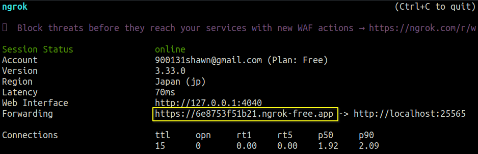
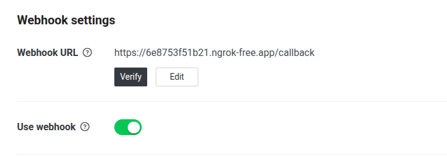
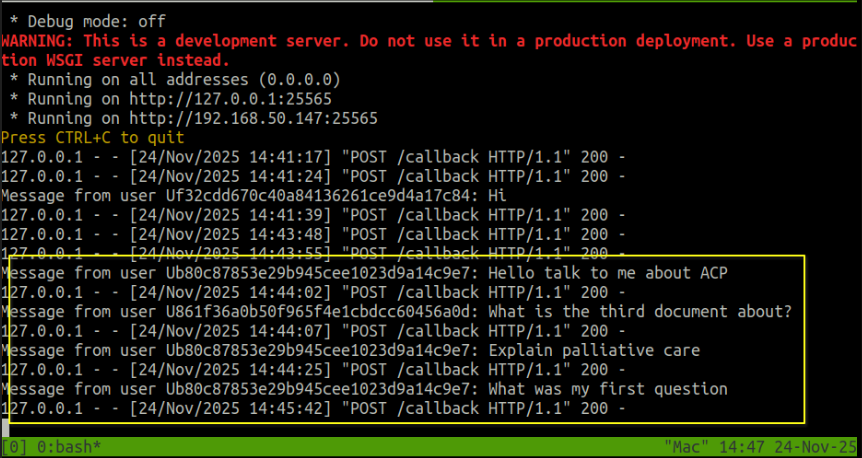

# How to Setup Line Bot

## 1. LINE Developers Console Setup

1. **Log in:** Go to [Line Developers Console](https://developers.line.biz/en/) and log in with your LINE account.
2. **Create Provider:** Click "**Create a new provider**" (This is essentially your "Company" or "Project Group" name).
3. **Create Channel:**
   * Select "Create a Messaging API channel".
   * Fill in the required fields (Channel name, description, category).
   * After creating channel, it will bring you to **LINE Official Account Manager**, setting $\rightarrow$ Messaging API to enable the API.
4. **Get Credentials:**
    * Back to Developers console.
    * Go to the "Basic Settings" tab $\rightarrow$ Copy Channel Secret.
    * Go to the "Messaging API" tab $\rightarrow$ Generate and Copy Channel Access Token (long-lived)
    * please save your channel secrt and token in a file and naming `.env`


>  this is `.env` file content below
```
LINE_CHANNEL_SECRET=fill_your_secret
LINE_CHANNEL_ACCESS_TOKEN=your_token
```

## 2. Development (Python/Flask Example)


### project structure

please check the file `.env` is as same level as main.py

```
.
├── main.py  # main logic
├── .env     # secrets (never commit this!)
└── ...
```

### [Installing uv](https://docs.astral.sh/uv/getting-started/installation/)

1. run `uv sync` to install dependency and update environment. 

2. run `uv run main.py` to run the bot server or your can write your own start script. (the example is in [script/run_backend.sh](../script/run_backend.sh))

> For more coding information please check [line-bot-sdk-python](https://github.com/line/line-bot-sdk-python)

### [Install ngrok](https://ngrok.com/download/mac-os)

after install run `ngrok http 25565` to get an url



and fill in **url + /callback** in the slot and enable webhook. (Line console $\rightarrow$ your channel $\rightarrow$ Messaging API $\rightarrow$ Webhook settings)



Now say something to bot and check the server can get the meassage.
> You need setup ollam setting first.




> ngrok is for fast checking the result, please change it for deployment.
> * PaaS
>   * Renser
>   * Railway
>   * Fly.io
> * Serverless
>   * Vercel
>   * AWS Lambda
>   * Google Cloud Functions